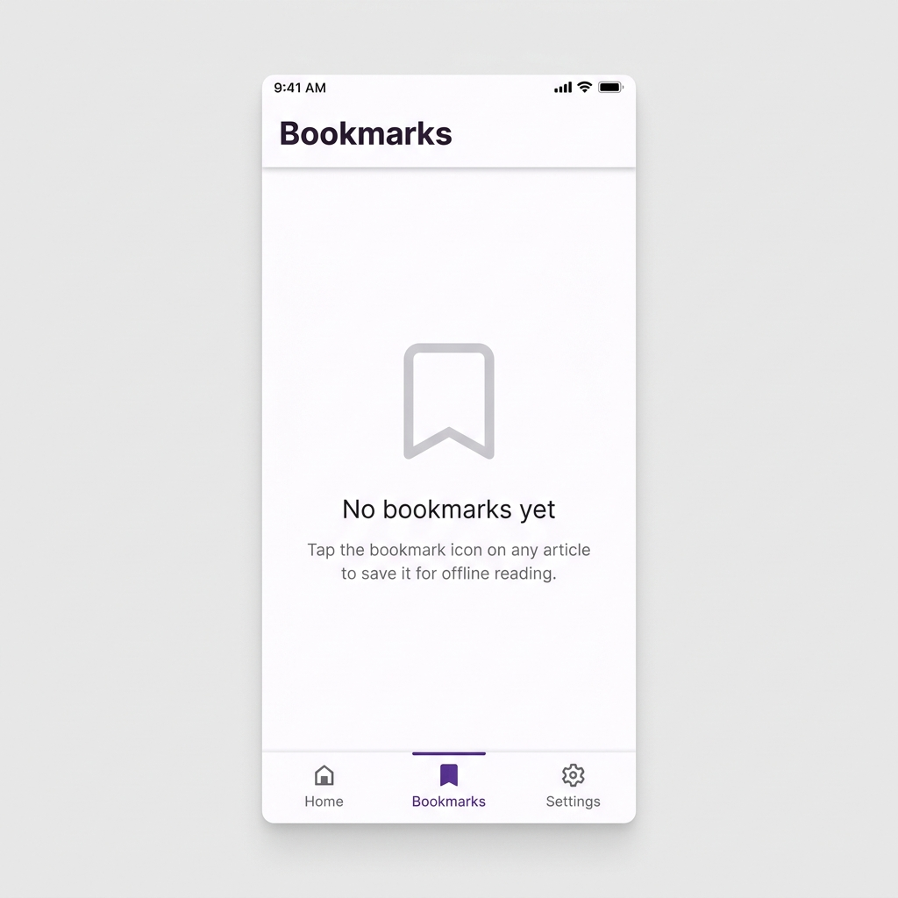
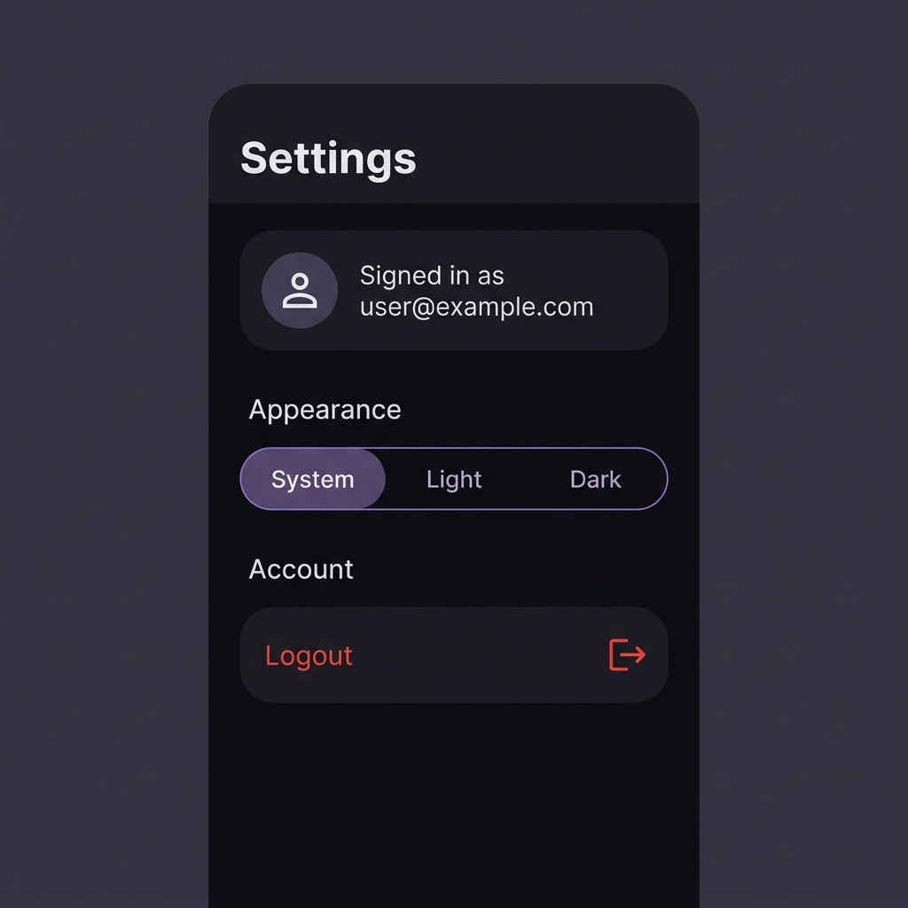

# 📰 News Reader — News Coverage App

> News Reader is a Flutter app that brings the latest spaceflight news to your phone. You can sign in, scroll an endless feed of articles, search by title or keyword, and bookmark stories to read offline. It supports light and dark themes and works on phones and tablets. Under the hood it uses MVVM with Clean Architecture, Provider for state management, Dio for networking, Hive for local storage, and GoRouter for navigation. Every screen handles loading, empty, error and offline states, and 53 automated tests cover the logic.


---


## ✨ Features

- **Mock authentication** — email and password validation, a "Keep me signed in" option that restores the session after a restart, and logout.
- **News feed** — article cards with thumbnail, title, source, published date and short description. Infinite scrolling, pull-to-refresh and shimmer skeleton loading.
- **Live search** — debounced search by title or keyword with a clear button; results update as you type and stale responses are cancelled.
- **Bookmarks** — add and remove bookmarks, stored locally and readable offline. Swipe to remove with an undo option.
- **Theme** — Light, Dark and System modes, persisted across launches.
- **Article detail** — Hero image transition, collapsing app bar, and a button to open the full article in the browser.
- **Resilient by design** — typed errors with retry, an offline banner, and an empty state on every screen.
- **Responsive** — navigation adapts between a bottom bar and a side rail, and the article list becomes a grid on wider screens.

---

## 🔑 Demo Login

The authentication is mocked, so there is no backend or sign-up. Use:

| Field | Value |
|---|---|
| Email | `user@example.com` |
| Password | `password` |

Tick **Keep me signed in** to stay logged in after closing the app.

---

## 📸 Screenshots

| News Feed (Dark) | Article Detail (Light) | Bookmarks (Empty) | Settings (Dark) |
|:---:|:---:|:---:|:---:|
|  |  |  |  |

---

## 📦 APK Download

A pre-built release APK is available at the root of this repository:

```
news-reader-release.apk   (54.9 MB, Release build)
```

> **Install:** Transfer `news-reader-release.apk` to your Android device and open it. You may need to enable *"Install from unknown sources"* in your device settings.

---

## 🛠️ Project Setup

### Prerequisites

| Tool | Minimum Version |
|------|-----------------|
| Flutter | 3.32.0 |
| Dart SDK | 3.12.0 |
| Android SDK | API 21+ (minSdk) |

### 1 — Clone the Repository

```bash
git clone <repo-url>
cd <repo-folder>
```

### 2 — Install Dependencies

```bash
flutter pub get
```

### 3 — Run Code Generation (Freezed / JSON) — optional

Generated files (`*.freezed.dart`, `*.g.dart`) are already committed, so the app runs without this step. Regenerate only after modifying annotated models:

```bash
dart run build_runner build --delete-conflicting-outputs
```

### 4 — Run the App

```bash
# Debug mode
flutter run

# Release mode (Android)
flutter run --release
```

No API keys, `.env` files or backend setup are needed.

### 5 — Run Tests

```bash
flutter test
```

All **53 tests** (unit + widget + integration) pass with zero static-analysis issues (`flutter analyze`).

---

## ✅ Requirements Coverage

### Functional requirements

| Requirement | Implementation |
|---|---|
| **Authentication** — email and password validation, remember session, logout | `LoginScreen` with inline validation, `MockAuthRepository` persisting the session in Hive ("Keep me signed in"), logout from Settings, `GoRouter` redirect guard |
| **Home** — thumbnail, title, source, date, description | `ArticleCard` shown in a sliver list (grid on wide screens) |
| **Home** — infinite scroll, pull-to-refresh, loading, empty, error | Offset-based pagination (10 per page), `RefreshIndicator`, shimmer skeletons, empty state, `ErrorView` with retry, footer spinner / retry row |
| **Search** — title, keywords, clear, dynamic results | `NewsSearchBar` with debounce, server-side `search` parameter, clear button, `CancelToken` to drop stale requests |
| **Bookmark** — add, remove, offline, persistent | Hive-backed `BookmarkRepository`, optimistic toggle, Bookmarks tab reads local storage only |
| **Theme** — light, dark, persisted | `ThemeViewModel` saving `ThemeMode` to Hive, applied before the first frame |

### Technical requirements

| Required | Used |
|---|---|
| Riverpod or Provider | **Provider** (`ChangeNotifier` ViewModels + `context.select`) |
| Dio / HTTP | **Dio** |
| Hive or Sqflite | **Hive CE** |
| GoRouter | **go_router** |
| Freezed | **freezed** (state objects, entities, models) |
| Json Serializable | **json_serializable** |

---

## 📁 Folder Structure

```
lib/
├── app/
│   └── app_router.dart               # GoRouter config & auth redirect guard
│
├── core/
│   ├── error/
│   │   └── failures.dart             # Sealed Failure union (noInternet, timeout, server…)
│   ├── network/
│   │   ├── connectivity_service.dart # Stream-based online/offline detection
│   │   ├── dio_client.dart           # Dio instance factory (timeouts, logging)
│   │   └── dio_error_mapper.dart     # Maps DioException → typed Failure
│   ├── storage/
│   │   └── hive_boxes.dart           # Hive initialisation & typed box accessors
│   ├── theme/
│   │   ├── app_colors.dart           # Design tokens (brand palette, spacing constants)
│   │   ├── app_theme.dart            # Light & Dark ThemeData
│   │   └── app_typography.dart       # Text theme with Inter font
│   ├── utils/
│   │   ├── date_formatter.dart       # Relative time formatting ("2 hours ago")
│   │   ├── debouncer.dart            # Search input debounce utility
│   │   ├── responsive.dart           # Shared breakpoint helper (crossAxisCount)
│   │   └── result.dart               # Sealed Result<T> / Success / Err types
│   └── widgets/
│       ├── error_view.dart           # Reusable full-screen error widget
│       └── offline_banner.dart       # Animated connectivity status banner
│
├── features/
│   ├── auth/
│   │   ├── data/
│   │   │   └── mock_auth_repository.dart     # Hive-backed credential store (mock)
│   │   ├── domain/
│   │   │   └── auth_repository.dart          # Abstract auth interface
│   │   └── presentation/
│   │       ├── auth_view_model.dart           # Auth state (login / logout)
│   │       └── login_screen.dart              # Animated login UI
│   │
│   ├── bookmarks/
│   │   ├── data/
│   │   │   ├── bookmark_local_data_source.dart  # Hive read/write
│   │   │   └── bookmark_repository_impl.dart
│   │   ├── domain/
│   │   │   └── bookmark_repository.dart
│   │   └── presentation/
│   │       ├── bookmarks_screen.dart            # Dismissible cards + undo snack bar
│   │       └── bookmarks_view_model.dart        # Optimistic toggle + undo restore
│   │
│   ├── news/
│   │   ├── data/
│   │   │   ├── article_model.dart              # JSON ↔ ArticleModel (Freezed + JSON)
│   │   │   ├── news_remote_data_source.dart    # Dio HTTP calls
│   │   │   └── news_repository_impl.dart       # Translates DTO → domain + error mapping
│   │   ├── domain/
│   │   │   ├── article.dart                    # Domain entity (Freezed)
│   │   │   ├── news_page.dart                  # Pagination result envelope
│   │   │   └── news_repository.dart            # Abstract repo interface
│   │   └── presentation/
│   │       ├── article_detail_screen.dart      # Hero image + collapsing app bar
│   │       ├── news_feed_screen.dart           # Sliver list/grid with all states
│   │       ├── news_feed_state.dart            # Immutable state (Freezed)
│   │       ├── news_feed_view_model.dart       # Pagination, search, refresh, cache
│   │       └── widgets/
│   │           ├── article_card.dart           # Reusable card (Hero, bookmark toggle)
│   │           ├── news_search_bar.dart        # Debounced TextField with clear action
│   │           └── shimmer_article_card.dart   # Loading skeleton card
│   │
│   ├── settings/
│   │   └── presentation/
│   │       ├── settings_screen.dart
│   │       └── theme_view_model.dart           # Persists ThemeMode to Hive
│   │
│   └── shell/
│       └── presentation/
│           └── shell_screen.dart              # Adaptive nav (BottomBar ↔ Rail)
│
└── main.dart                                  # DI wiring + MultiProvider root

test/
├── fixtures/         # article_fixture.json
├── integration/      # app_flow_test.dart — Login → Feed → Bookmark → Tab
├── unit/             # 9 unit-test files (ViewModel, repo, mapper, formatter…)
└── widget/           # ArticleCard, LoginScreen, ErrorView widget tests
```

---

## 🏛️ Architecture

The app follows **Clean Architecture** with **MVVM** as the presentation pattern.

```
┌──────────────────────────────────────────────────┐
│              Presentation Layer                   │
│  Screen (Widget)  ←→  ViewModel (ChangeNotifier) │
│  • Reads immutable State (Freezed)                │
│  • Calls ViewModel methods                        │
├──────────────────────────────────────────────────┤
│               Domain Layer                        │
│  Repository Interface (abstract)                  │
│  Domain Entities  (Article, NewsPage)             │
│  Result<T>, Failure (sealed)                      │
├──────────────────────────────────────────────────┤
│                Data Layer                         │
│  RepositoryImpl  → RemoteDataSource (Dio)         │
│                  → LocalDataSource  (Hive)        │
│  DTOs / Models   (ArticleModel, Freezed+JSON)     │
└──────────────────────────────────────────────────┘
```

**Data flow:** a user action in a Screen calls a ViewModel method → the ViewModel calls a repository interface → the repository implementation fetches from Dio or Hive and returns a `Result<T>` → the ViewModel emits a new immutable state → only the widgets that depend on it rebuild.

**Relation to MVC:** MVVM belongs to the same family as MVC. The Screens are the *View*, the Domain and Data layers are the *Model*, and the `ChangeNotifier` ViewModels play the *Controller* role while also exposing observable state to the View.

### Key Design Decisions

| Decision | Rationale |
|---|---|
| **`sealed class Result<T>`** | Exhaustive, compile-time safe success/error propagation, so no uncaught exceptions reach the UI |
| **Freezed state objects** | Immutable state prevents accidental mutation; `copyWith` is concise and safe |
| **Provider + ChangeNotifier** | Proportionate complexity for a 4-feature app; simple to test and avoids Riverpod/BLoC boilerplate |
| **`context.select`** | Granular rebuilds, so `ArticleCard` only rebuilds when its own bookmark status changes |
| **CancelToken on every request** | Prevents stale responses when the user types quickly or navigates away |
| **In-memory default page cache** | Restores the feed instantly on search clear with no network round-trip |
| **Optimistic bookmark updates** | The UI reflects the toggle in under one frame; the Hive write happens asynchronously |
| **Abstract `AuthRepository`** | The mock can be swapped for Firebase Authentication without touching the UI |
| **`AppResponsive.crossAxisCount`** | Single source of truth for phone / tablet / desktop breakpoints |

---

## 🌐 API

Data comes from the free, key-less **Spaceflight News API v4** (SNAPI).

| Item | Value |
|---|---|
| Base URL | `https://api.spaceflightnewsapi.net/v4` |
| Endpoint | `GET /articles/` |
| Parameters used | `limit` (page size), `offset` (pagination), `search` (title / summary), `ordering=-published_at` (newest first) |

Example request:

```
GET https://api.spaceflightnewsapi.net/v4/articles/?limit=10&offset=0&search=SpaceX&ordering=-published_at
```

| App field | API field |
|---|---|
| Thumbnail | `image_url` |
| Title | `title` |
| Source | `news_site` |
| Published date | `published_at` |
| Short description | `summary` |
| Article link | `url` |

 
> Could not uses any other API as they all required keys and some limit the items per page which affect it's requirement for the  assignment.
---

## 📚 Packages Used

### Runtime Dependencies

| Package | Purpose |
|---|---|
| `provider ^6.1.5` | DI + state management (ChangeNotifier / MultiProvider) |
| `go_router ^18.0.2` | URL-based routing with auth redirect guard |
| `dio ^5.11.1` | HTTP with interceptors, cancel tokens, typed responses |
| `hive_ce ^2.20` + `hive_ce_flutter ^2.4` | Key-value local storage (bookmarks, session, settings) |
| `connectivity_plus ^7.3.2` | Real-time online/offline stream |
| `cached_network_image ^4.0.3` | Network image cache + shimmer placeholder |
| `shimmer ^4.0.0` | Skeleton loading animations |
| `intl ^0.20.2` | Locale-aware date formatting |
| `url_launcher ^6.3.3` | Opens articles in the system browser |
| `freezed_annotation ^3.1` | Annotations for code-generated immutable classes |
| `json_annotation ^4.12` | Annotations for code-generated JSON serialisation |

### Dev Dependencies

| Package | Purpose |
|---|---|
| `freezed ^4.0.0-dev.3` | Generates immutable data classes and sealed unions |
| `json_serializable ^6.14.1` | Generates `fromJson` / `toJson` |
| `build_runner ^2.15.1` | Code generation runner |
| `mocktail ^1.0.5` | Type-safe mock objects for unit tests |
| `fake_async ^1.3.3` | Controls async time in debouncer / ViewModel tests |
| `flutter_launcher_icons ^0.14.4` | App icon generation |
| `flutter_native_splash ^2.4.8` | Native splash screen |

---

## 🎨 Design System

Material 3 with the brand palette and the Inter typeface. All colors and spacing live in `core/theme/app_colors.dart`.

| Role | Color | Used for |
|---|---|---|
| Primary | `#4A38D9` (purple) | Buttons, selected navigation, links |
| Accent | `#D71D89` (pink) | Bookmarked state, active highlights |
| Tertiary | `#F48031` (orange) | Source chips, offline banner |

Dark mode uses lighter tints of the same hues to keep text contrast readable.

---

## ✅ State Handling — All Screens

| Screen | Loading | Empty | Error | Paginating | Offline |
|---|:---:|:---:|:---:|:---:|:---:|
| **News Feed** | Shimmer skeleton (4–6 cards) | Icon + message + clear search button | `ErrorView` + retry | Footer spinner / retry row | `OfflineBanner` |
| **Article Detail** | `CircularProgressIndicator` | — | `ErrorView` + retry | — | — |
| **Bookmarks** | — | Bookmark icon + message | — | — | `OfflineBanner` |
| **Login** | Button loading indicator | — | Inline error text | — | — |

---

## 🚨 Error Handling

Every network failure is mapped to a typed `Failure` in `dio_error_mapper.dart`, so the UI never handles raw exceptions.

| Scenario | How it is handled |
|---|---|
| **No internet** | Mapped to a `noInternet` failure. The feed shows `ErrorView` with a retry button, the `OfflineBanner` appears, and the Bookmarks tab keeps working from local storage |
| **API timeout** | Mapped to a `timeout` failure with a clear message and retry. If it happens while loading more, an inline retry row appears and the articles already loaded stay on screen |
| **Invalid response** | Malformed or unexpected data is caught and mapped to an `invalidResponse` failure instead of crashing |
| **Server error** | Non-success status codes are mapped to a `server` failure carrying the status code |
| **Empty results** | A dedicated empty state; for searches it shows the query with a **Clear search** button |

---

## 🧪 Testing

```bash
flutter test            # run all 53 tests
flutter test --coverage # optionally generate coverage/lcov.info
```

| Type | What it covers |
|---|---|
| **Unit** (9 files) | ViewModels (pagination, search debounce, stale-response handling), repositories, Dio error mapper, date formatter and more |
| **Widget** | `ArticleCard`, `LoginScreen` validation, `ErrorView` |
| **Integration** | Full flow: Login → Feed → Bookmark → Bookmarks tab (`test/integration/app_flow_test.dart`) |

Tests use `mocktail` for mocks and `fake_async` for time-based logic. No test touches the real network.

---

## 🔒 Assumptions

1. **Authentication is mocked.** There is no real backend. The credentials `user@example.com / password` are hardcoded in `MockAuthRepository`. The session is persisted to Hive so the user stays signed in across restarts when *"Keep me signed in"* is checked.

2. **API is public and unauthenticated.** The Spaceflight News API v4 does not require an API key. No secrets or `.env` files are needed to run the project.

3. **Bookmarks are local-only.** Saved articles are stored in Hive on-device and are not synced to any server or user account.

4. **Offline shows only cached bookmarks.** When the device is offline the news feed enters an error state (live articles cannot be fetched). The Bookmarks tab continues to function because it reads from local storage.

5. **Pagination limit is fixed at 10.** The API supports up to 100 items per page; 10 provides a smooth scroll-to-load experience without over-fetching on mobile connections.

6. **Dark/Light mode defaults to system.** `ThemeMode.system` is the default. Users can override it in Settings and the preference persists across app launches via Hive.

7. **No real-time push notifications.** The app does not implement WebSocket or FCM. New articles are surfaced only through manual pull-to-refresh.

---


## 🔧 Building from Source

```bash
# Debug APK
flutter build apk --debug

# Release APK
flutter build apk --release

# Android App Bundle (for Play Store)
flutter build appbundle --release
```

Output: `build/app/outputs/flutter-apk/app-release.apk`

> The release APK is signed with the default debug key, which is sufficient for this assessment. A production release would use a dedicated keystore.

---
